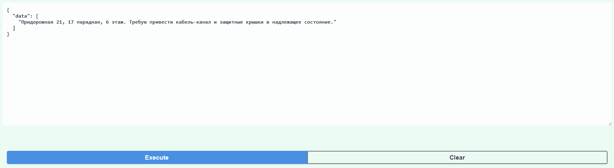

# API

## Организация файлов

- Модели хранятся в папке ./Models/
- Загрузить модели можно с папки https://drive.google.com/drive/folders/16KhtZbdi2Z1DuxIwXHhGSUTxMcTd2dkv?usp=sharing

## Описание работы

**Входные данные** - *JSON* обьект с полем data, представляющем из себя список обращений;

**Выходные данные** - *JSON* обьект с полем data, представляющем из себя словарь, где ключ - само обращение, а значение словарь с выделенными параметрами:
- place - место;
- problem - проблемма;
- executor - исполнитель;
- theme - тема;
- theme_group - группа тем.

## Пример работы

**Входные данные**

```
    {
        "data": [
            "Придорожная 21, 17 парадная, 6 этаж. Требую привести кабель-канал и защитные крышки в надлежащее состояние."
        ]
    }
```


**Выходные данные**

```
{
  "data": {
    "Придорожная 21, 17 парадная, 6 этаж. Требую привести кабель-канал и защитные крышки в надлежащее состояние.": {
      "place": [
        "Придорожная 21, 17 парадная, 6 этаж"
      ],
      "problem": [
        "привести кабель-канал и защитные крышки в надлежащее состояние"
      ],
      "executor": "Губахинский городской округ",
      "theme_group": "ЖКХ",
      "theme": "Проблемы с контейнерами"
    }
  }
}
```
